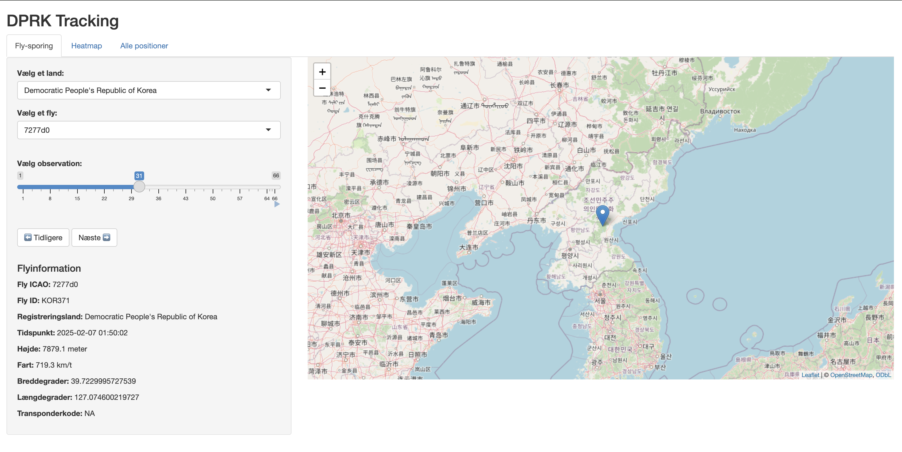
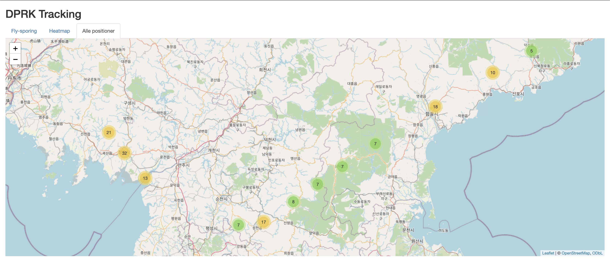

# ✈️ DPRK Tracking — Shiny App

[🔗 Se appen live her](https://lukasbachcouzy.shinyapps.io/dprk/)

Denne applikation er udviklet i R og visualiserer flyaktivitet over og omkring Nordkorea (DPRK). Ved hjælp af OpenSky Network data og interaktive elementer i Shiny og Leaflet kan brugeren:

- Vælge et land og et fly baseret på dets `icao24`
- Se flyets position på et kort over tid
- Få detaljeret information om hastighed, højde og retning
- Se alle positioner i en samlet visning
- Analysere flybevægelse via heatmap

## 🗺️ Funktioner

### 1. **Fly-sporing**
- Vælg land (eks. DPRK, Sydkorea eller USA)
- Vælg specifikt fly (ICAO-kode)
- Brug slideren til at navigere gennem observationstidspunkter
- Automatisk opdatering af kort og detaljer

📷 Eksempel:



---

### 2. **Heatmap**
Heatmappet viser alle registrerede positioner med vægtning efter tæthed.

📷 Eksempel:


---

### 3. **Alle positioner**
En samlet visning af alle flypositioner i dataen, med popup-information for hver registrering.

📷 Eksempel:



---

## 🌍 Lande i datasættet

| Land                                      | ICAO-eksempler | Beskrivelse                                           |
|------------------------------------------|----------------|--------------------------------------------------------|
| Democratic People's Republic of Korea    | `7277d0`          | Nordkoreanske fly (primært mål)                      |
| Republic of Korea (South Korea)          | `71cb15`          | Sydkoreanske fly (regional interesse)                |
| United States of America (USA)           | `ae64a7`          | Amerikanske fly (international overvågning og tilstedeværelse) |

*(Baseret på observerede fly og `origin_country` i datasættet.)*

---

## 📁 Struktur

- `dprk_Flights.csv` — dataset brugt til visualisering
- `app.R` — hovedfil for appen
- `images/` — mapper til screenshots og billeder
- `README.md` — denne fil

---

## 🚀 Deployment

Appen er deployet på shinyapps.io ved hjælp af `rsconnect`:

```r
library(rsconnect)
rsconnect::setAccountInfo(name='USER', token='XXX', secret='XXX')
rsconnect::deployApp('/path/to/app-folder')
